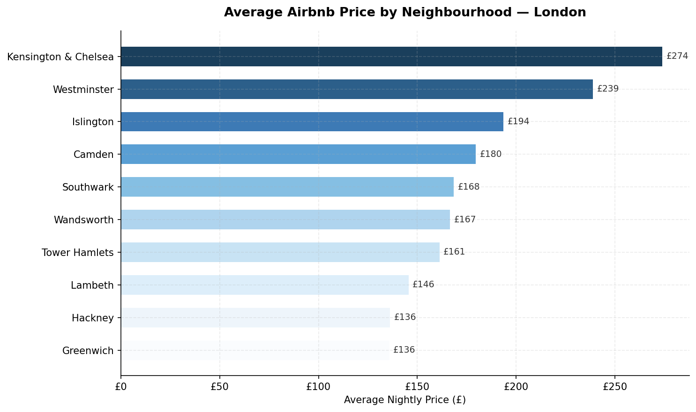
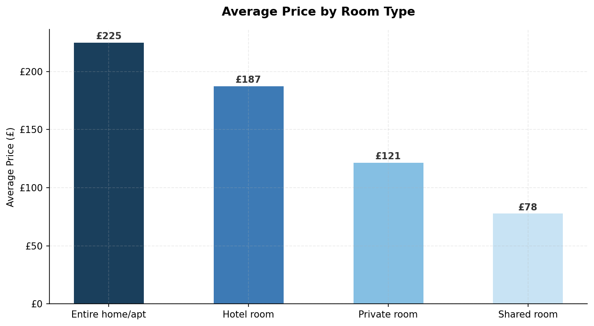
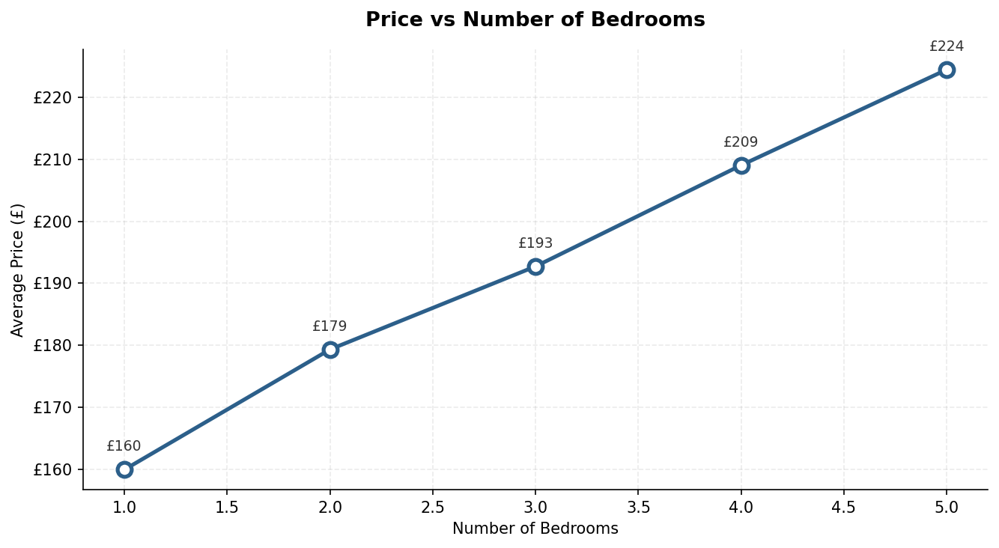
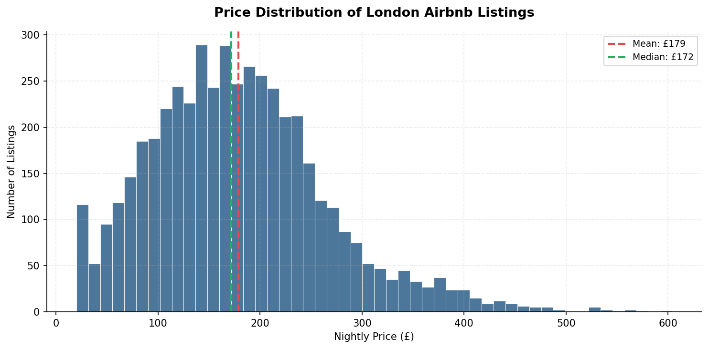
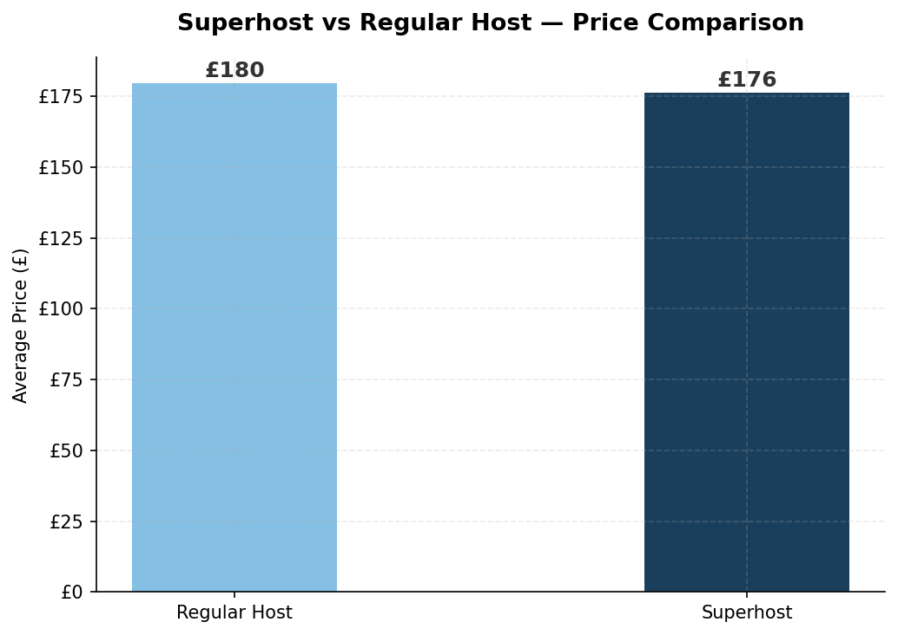

# Airbnb Price Analysis — London

## Overview
Analysis of 4,800 Airbnb listings across 10 London neighbourhoods to identify key pricing drivers and uncover undervalued listing opportunities.

## Tools Used
- Python (Pandas, Matplotlib)
- SQL (MySQL)
- Tableau

## Business Questions Answered
1. Which neighbourhood is the most expensive?
2. Which room type commands the highest price?
3. Does more bedrooms mean higher price?
4. Do superhosts charge more than regular hosts?
5. Where are the most undervalued listing opportunities?

## Key Findings
- Kensington & Chelsea is the most expensive area at £274 per night average
- Entire home listings earn 85% more than private rooms at £225 vs £121
- Each additional bedroom adds approximately £16 to the nightly price
- Superhost status does not drive a significant price premium
- 459 undervalued listings found — highly rated but priced 25% below area average

## Files
- `airbnb_analysis.py` — Python analysis code
- `queries.sql` — SQL queries
- `undervalued_listings.csv` — 459 undervalued listings
- `charts/` — All visualisations

## Charts

